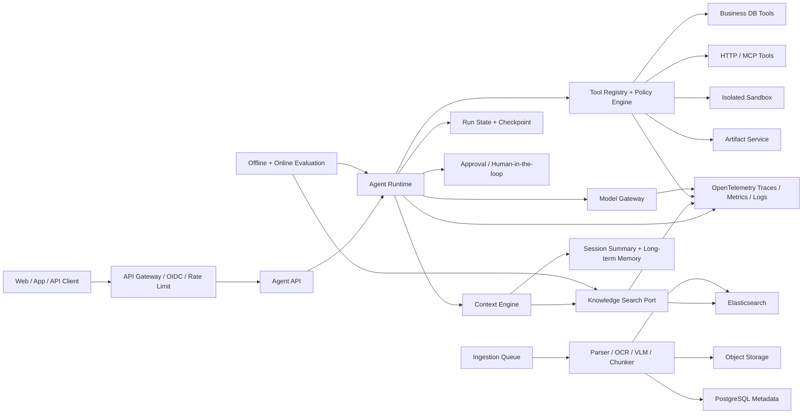

# FileAgent：从 Agentic RAG 到企业生产级系统的完整开发路线图

> 版本：v1.0
>
> 日期：2026-09-07
>
> 状态：待确认后分阶段实施
>
> 适用范围：`fileAgent` 主应用与 `ragflow-quickstart` 对照实验模块

---

## 1. 结论与定位

当前实现并不是“初级 RAG”。它已经覆盖了企业 RAG 检索链路中最重要的一批能力：

- 多格式文本解析；
- Elasticsearch BM25 + KNN 混合召回；
- RRF 排名融合；
- 可选 reranker 与最低相关性过滤；
- CHILD 精确召回、PARENT 完整上下文恢复；
- 多轮问题改写；
- 带来源标记的 Prompt 与 SSE 流式回答。

它当前较完整的是“检索算法链路”，但距离真实企业项目还缺少另外几条能力轴：

1. **Agentic RAG**：由 Agent 判断是否检索、检索什么、是否继续检索，以及何时调用业务工具。
2. **多模态 RAG**：保留并理解图片、扫描件、表格、图表、音频、视频等非纯文本信息。
3. **知识工程**：数据同步、版本、权限、血缘、质量、增量索引与删除闭环。
4. **Agent 工程**：持久化运行状态、暂停恢复、人工审批、幂等、预算和失败补偿。
5. **企业治理**：身份、租户隔离、审计、安全、评测、可观测、SLO、灾备和成本控制。

因此后续不是推翻当前 RAG，而是将它升级为 Agent 可调用的可靠“上下文引擎”。

---

## 2. 当前基线与差距

### 2.1 已具备的能力

| 能力 | 当前状态 | 主要位置 |
|---|---|---|
| 全局知识文件上传 | 已实现 | `RagFileController` / `RagFileAppServiceImpl` |
| TXT、MD、PDF 文本层、DOCX、Excel、CSV 解析 | 已实现 | `fileagent-document/infrastructure` |
| 父子分块 | 已实现 | `RagFileAppServiceImpl` / `KnowledgeChunk` |
| BM25 + KNN | 已实现 | `KnowledgeSearchPortImpl` |
| RRF 融合 | 已实现 | `RrfFusion` |
| reranker 与相关性阈值 | 已实现，可选 | `DashScopeKnowledgeReranker` |
| 元数据过滤 | 已实现基础条件 | `KnowledgeSearchPort.SearchQuery` |
| 多轮问题改写 | 已实现 | `RagQueryRewriter` |
| RAG Prompt 防文档指令污染 | 已实现基础规则 | `RagPromptBuilder` |
| SSE 流式回答 | 已实现 | `ChatController` / `ChatAppServiceImpl` |
| Agent 动作接口骨架 | 仅骨架 | `fileagent-action` |
| RAGFlow 数据集与 Chat API 实验 | 已实现 | `ragflow-quickstart` |

### 2.2 企业落地前的主要缺口

| 维度 | 当前缺口 |
|---|---|
| Agent Runtime | 固定执行一次检索，没有工具循环、步骤状态、暂停恢复和运行预算 |
| 工具系统 | 只有 `ActionHandler` 骨架，没有工具 Schema、权限、版本、超时、幂等和审计 |
| 引用 | 主要返回来源文件名，没有句子级结论与 chunk/page/bbox 的可验证映射 |
| 多模态 | PDF 主要抽文本层；图片、扫描件、图表和文档内嵌图片没有完整链路 |
| 原文件 | RAG 上传流程没有形成稳定的对象存储、版本与生命周期管理 |
| 摄取任务 | 缺少生产级异步队列、重试、死信、断点续跑和索引版本切换 |
| 权限 | 没有认证、RBAC/ABAC、租户隔离和检索时 ACL 下推 |
| 数据库 | H2 适合学习和单机，不适合作为多实例生产元数据存储 |
| 评测 | 没有固定数据集、离线评测、回归阈值和线上反馈闭环 |
| 可观测 | 有日志，但没有完整 run/step/tool/model/retrieval trace、指标和告警 |
| 可靠性 | 没有全链路幂等、熔断、降级、配额、灾备和明确 SLO |
| 安全 | 尚未系统覆盖间接 Prompt Injection、工具投毒、越权、SSRF 与数据外泄 |

---

## 3. 能力分层：不要把所有“高级 RAG”混为一谈

### 3.1 RAG 成熟度阶梯

| 层级 | 名称 | 核心能力 | 本项目状态 |
|---|---|---|---|
| L0 | LLM Chat | 只使用模型参数知识 | 已具备降级路径 |
| L1 | 基础 RAG | 单路向量检索 + Prompt | 已超过 |
| L2 | 高质量检索 RAG | 混合召回、rerank、父子块、过滤、引用 | 当前主体已完成 |
| L3 | Adaptive RAG | 根据问题选择检索策略、数据源、TopK 和模型 | 待实现 |
| L4 | Agentic RAG | 多步规划、工具调用、结果反思、继续/停止决策 | 下一阶段 |
| L5 | Multimodal RAG | 文本、表格、图片、音频等统一摄取、检索和生成 | 待实现 |
| L6 | Knowledge Platform | 连接器、权限、版本、血缘、质量、生命周期 | 待实现 |
| L7 | Enterprise Agent | HITL、审计、隔离、SLO、灾备、成本与治理 | 最终必需 |
| L8 | Advanced Optional | GraphRAG、RAPTOR、原生跨模态、多 Agent | 按评测选择 |

### 3.2 三条能力轴

```text
检索质量轴：混合召回 -> rerank -> 评测 -> 自适应检索 -> GraphRAG/RAPTOR
Agent 能力轴：工具调用 -> ReAct -> 持久化状态 -> HITL -> 业务动作 -> 多 Agent
数据模态轴：文本 -> OCR/表格 -> VLM 描述 -> 原图参与回答 -> 原生跨模态检索
```

“用了 Agent”不代表检索质量更高；“用了 VLM”也不代表完成原生跨模态检索。三条轴必须分别设计、分别评测。

---

## 4. 企业目标架构



### 4.1 核心架构决策

1. **保留模块化单体作为业务形态**。在规模数据证明需要之前，不拆微服务。
2. **摄取任务独立为异步 Worker**。文档解析耗时长、资源波动大，先与在线问答线程池隔离。
3. **Agent Runtime 通过 Port 接入**。推荐将 AgentScope Java 2.x 放在 infrastructure 适配器内，chat/application 不直接依赖其 SDK 类型。
4. **现有 `KnowledgeSearchPort` 直接演进为 `search_docs` 工具底座**，不重写混合检索。
5. **身份和权限由服务端注入 ToolContext**，禁止让模型生成 `tenantId/userId/role` 等可信身份。
6. **PostgreSQL 管元数据和运行状态，Elasticsearch 管检索，对象存储管原文件和产物，Redis 管短期缓存与限流**。
7. **工具协议优先使用内部 Java 契约，对外集成再支持 MCP**。MCP 是互操作协议，不代替业务授权。
8. **不存储模型原始思维链**。只保存计划摘要、工具调用、输入输出摘要、证据、状态和错误。
9. **所有高级检索策略必须通过评测门禁**。没有稳定增益的 GraphRAG、HyDE、RAPTOR 不进入生产主链路。

---

## 5. 分阶段开发计划

每个阶段都必须满足退出门槛才能进入下一阶段。阶段估时按单人全职估算；学习型兼职项目通常需要约 1.5 至 2 倍时间。

| 阶段 | 核心结果 | 前置依赖 | 单人全职估算 |
|---|---|---|---|
| Phase 0 | 可重复的 RAG 质量基线 | 当前实现 | 1～2 周 |
| Phase 1 | 最小 Agentic RAG | Phase 0 | 2～3 周 |
| Phase 2 | Adaptive RAG 与可验证引用 | Phase 1 | 2～3 周 |
| Phase 3 | 持久化运行、HITL 和安全工具 | Phase 1 | 3～4 周 |
| Phase 4 | 文档型多模态闭环 | Phase 0、2 | 3～5 周 |
| Phase 5 | 企业知识摄取与生命周期 | Phase 0 | 3～5 周 |
| Phase 6 | Memory、连接器与业务动作 | Phase 3、5 | 3～5 周 |
| Phase 7 | 多租户和安全治理 | Phase 3、5、6 | 3～5 周 |
| Phase 8 | 可观测、可靠性和成本治理 | Phase 1～7 持续建设 | 3～4 周集中完善 |
| Phase 9 | 生产部署与运营 | Phase 0～8 | 2～4 周 |
| Phase 10 | GraphRAG、原生跨模态、多 Agent | 由专项评测决定 | 不预估 |

按严格串行计算，必选阶段约 25～40 个全职开发周。实际可将 Phase 4、5 与部分 Phase 8 并行，但安全、权限和可观测不能拖到上线前一次性补做。

### 5.1 Phase 0：冻结当前 RAG 基线并建立评测体系

**目标**：先证明当前链路的真实水平，为后续所有改动建立比较基准。

**预计**：1～2 周。

#### 开发任务

- 建立 `fileagent-evaluation` 模块或独立测试目录。
- 定义评测样本：问题、期望答案要点、允许来源、禁止来源、问题类型。
- 首批准备不少于 100 条样本，覆盖：
  - 关键词精确匹配；
  - 语义改写；
  - 多文档对比；
  - 多轮指代；
  - 无答案问题；
  - 冲突资料；
  - 表格聚合；
  - Prompt Injection 文档。
- 分开评测三层：
  - Retrieval：Recall@K、MRR、nDCG、命中正确文档率；
  - Generation：事实完整率、忠实度、拒答准确率、引用正确率；
  - System：P50/P95 延迟、Token、模型费用、异常率。
- 固化当前配置、模型版本、索引版本和结果，生成 baseline 报告。
- 建立 PR 回归门禁：核心指标下降超过阈值时失败。

#### 验收门槛

- 评测可通过一个 Maven 命令离线运行。
- Mock 模型评测进入普通 CI，真实模型评测进入手动或定时流水线。
- 每次报告能关联 Git commit、模型、Prompt、索引和数据集版本。
- 当前 RAG 基线结果已保存，且能重复运行。

---

### 5.2 Phase 1：Agent Runtime 与最小 Agentic RAG

**目标**：把“固定检索一次”升级为“Agent 自主决定检索、继续检索或直接回答”。

**预计**：2～3 周。

#### 领域与运行时契约

- 新增 `AgentRuntimePort`，输入可信 `AgentRequestContext`，返回受控事件流。
- 定义 `AgentRun`、`AgentStep`、`ToolCall`、`ToolResult`、`AgentBudget`。
- 定义运行状态：
  - `PENDING`
  - `RUNNING`
  - `WAITING_USER_INPUT`
  - `WAITING_APPROVAL`
  - `SUCCEEDED`
  - `FAILED`
  - `CANCELLED`
  - `TIMED_OUT`
- 第一版只注册三个只读工具：
  - `search_docs`
  - `list_knowledge_files`
  - `read_document_context`
- 为每个工具定义稳定 JSON Schema、版本、超时、最大结果数和错误码。
- Agent 循环设置硬限制：最大步骤数、最大模型调用数、总超时、Token 上限和费用上限。

#### 兼容迁移方式

- 保留现有 `POST /api/sessions/{id}/chat` 作为固定 RAG 基线和故障降级路径。
- 新增 `POST /api/sessions/{id}/agent-runs` 创建 Agent Run，不直接改写旧接口语义。
- 增加 `GET /api/agent-runs/{runId}` 查询状态和步骤摘要。
- 增加 `POST /api/agent-runs/{runId}/cancel` 取消运行。
- Phase 3 再增加 `POST /api/agent-runs/{runId}/approvals/{approvalId}` 审批与恢复接口。
- Agentic 路径经过离线评测、shadow 和灰度验证后，才考虑成为默认聊天入口。
- 任意阶段均可通过 Feature Flag 关闭 Agent 工具循环，退回固定 RAG。

#### SSE 事件升级

建议增加：

| 事件 | 面向用户的内容 |
|---|---|
| `run.started` | 本次任务已开始 |
| `run.status` | 正在检索、分析、生成，不暴露思维链 |
| `tool.started` | 工具名与安全摘要 |
| `tool.completed` | 成功状态、结果数量、耗时，不返回敏感原文 |
| `approval.required` | 待审批动作摘要与风险 |
| `message.delta` | 最终回答增量 |
| `sources` | 结构化引用 |
| `run.completed` | 运行与消息 ID |
| `run.failed` | 稳定错误码和用户可见说明 |

#### 验收场景

- 普通知识问题只检索一次并回答。
- 常识问题不调用知识库。
- 对比问题自动拆成两个检索步骤。
- 首次检索为空时自动换关键词，但最多重试一次。
- 找不到证据时明确拒答，不循环到上限。
- 达到预算、超时或最大步骤时可预测地终止。
- SSE 取消后模型与工具调用同步取消，不能继续后台消耗费用。

---

### 5.3 Phase 2：Adaptive RAG 与可验证引用

**目标**：让 Agent 不只是“能搜”，还会选择正确的检索策略，并能证明结论来自哪里。

**预计**：2～3 周。

#### 开发任务

- 查询分类：无需检索、单跳检索、多跳检索、比较、聚合、时间敏感。
- 支持 query decomposition，将复杂问题拆成有限子问题。
- 支持受控 multi-query，不允许无限扩写。
- 按问题类型选择：
  - 元数据过滤；
  - BM25/KNN 权重；
  - TopK；
  - 是否 rerank；
  - 是否读取完整父块。
- 增加 `get_chunk` / `get_document_outline`，避免每次把大父块全部塞给模型。
- 建立上下文预算器，分别限制历史、检索证据、工具结果和用户输入。
- 引用升级到：`fileId/documentVersion/chunkId/page/sheet/bbox/quoteHash`。
- 答案生成后执行 citation verification，检查每项关键结论是否存在支持证据。
- 将检索候选、最终上下文和最终引用分开记录，禁止混为一个概念。

#### 验收门槛

- 多跳题和比较题相对 Phase 0 基线有统计上稳定的提升。
- 无答案问题的错误作答率不因 Agent 重试上升。
- 每个关键事实可以定位到固定版本的原文件区域。
- 单请求上下文、步骤数、Token 和费用均有硬上限。

---

### 5.4 Phase 3：持久化 Agent、HITL 与安全工具执行

**目标**：Agent 可以安全地暂停、审批、恢复和执行有副作用的动作。

**预计**：3～4 周。

#### 开发任务

- 将 `AgentRun` 和每个 `AgentStep` 持久化，支持进程重启后恢复。
- 每个 Tool Call 使用唯一幂等键，防止重试导致重复发送、重复写库。
- 工具风险等级：
  - `READ_ONLY`：可自动执行；
  - `LOW_RISK_WRITE`：按策略执行；
  - `HIGH_RISK_WRITE`：强制人工审批；
  - `PROHIBITED`：永不开放给模型。
- 审批记录包含动作摘要、资源范围、预计影响、过期时间、审批人和审批结论。
- 实现 `ALLOW / DENY / ASK` 权限策略。
- 工具参数先做 Schema 校验，再做业务授权和资源级权限检查。
- 外部 HTTP 工具增加域名白名单、DNS/IP 校验、重定向限制和响应大小限制。
- 代码执行从业务进程剥离到隔离沙箱，默认无网络、只读文件系统、CPU/内存/时间限制。
- 错误回流给模型前进行脱敏，不返回 SQL、Token、堆栈或内部地址。

#### 验收门槛

- 应用在 `WAITING_APPROVAL` 时重启，恢复后仍可审批并继续。
- 相同幂等键重复提交不会重复执行副作用。
- 模型无法通过工具参数伪造租户、用户或角色。
- Prompt Injection 测试无法绕过工具白名单与审批策略。
- 沙箱逃逸、SSRF、超时和大响应均有自动化安全测试。

---

### 5.5 Phase 4：文档型多模态 RAG

**目标**：正确理解扫描件、文档内图片、图表和复杂表格，并在回答时使用原始视觉证据。

**预计**：3～5 周。

#### 统一内容模型

将纯文本 Chunk 演进为 Content Unit：

```text
ContentUnit
- id
- documentId / documentVersion
- modality: TEXT | TITLE | TABLE | IMAGE | AUDIO_TRANSCRIPT | VIDEO_FRAME
- textRepresentation
- page / sheet / slide
- boundingBox / timeRange
- assetId
- parentId
- metadata
- parserVersion / modelVersion
```

原始二进制、页面图和裁剪图进入对象存储，ES 只保存检索字段与对象引用。

#### 摄取链路

- PDF：文本层 + 版面识别；扫描页走 OCR；复杂表格和公式使用专业解析器或 VLM。
- DOCX/PPTX：保留标题层级、段落、表格、图片与图片所在位置。
- 图片：OCR 文本 + VLM caption + 原图。
- 表格：结构化 JSON/HTML + 文本摘要 + 表头语义。
- 音频：ASR 转写，带 speaker 和时间戳。
- 视频：ASR + 关键帧抽取 + 帧描述，先不做全帧向量化。
- 所有处理器保存 parser/model/prompt 版本，以支持重建与追责。

#### 分阶段检索策略

1. **第一阶段，文本化检索**：对 OCR、caption、表格摘要生成文本向量，复用当前 BM25/KNN/RRF。
2. **第二阶段，多模态生成**：命中图片或表格后，将原始裁剪图与文本证据一起发送给 VLM。
3. **第三阶段，原生跨模态检索**：只有评测证明需要时，增加视觉 embedding 和 text-to-image 检索。

#### 验收门槛

- 扫描 PDF 可以回答正文问题并定位页码。
- 可以回答“图中哪个季度下降最多”，且真正向 VLM 提供目标图表。
- 文档内多张图片不会串页、串 Sheet 或串 Slide。
- 表格数值和单位不会在文本化过程中丢失。
- 视觉引用能定位到原文件页码和 bbox，并展示原始区域。

---

### 5.6 Phase 5：企业知识摄取与生命周期

**目标**：把“手工上传文件”升级为可持续运行的知识平台。

**预计**：3～5 周。

#### 开发任务

- 原文件迁移到 S3/MinIO/OSS，数据库只存对象键和校验信息。
- H2 迁移到 PostgreSQL，使用 Flyway 管理 Schema。
- 引入异步任务队列，将上传、解析、embedding、索引分阶段执行。
- 每个阶段支持幂等、重试、超时、死信和人工重放。
- 建立 Dataset、Document、DocumentVersion、IngestionJob、IndexVersion。
- 支持增量更新、软删除、物理删除、保留期和 legal hold。
- 建立索引别名蓝绿切换：新索引构建和验证通过后原子切换。
- 连接器支持定时同步、游标、ETag/更新时间、删除同步和权限同步。
- 保存完整血缘：来源系统、源记录、解析版本、chunk、embedding、索引版本。
- 提供失败文档、低质量 OCR、空内容、重复内容和异常分块的运营页面。

#### 验收门槛

- 相同版本重复摄取不会产生重复 chunk。
- 文档更新后旧版本不再被新会话检索，但历史引用仍能追溯。
- 删除一个文档可以确认元数据、对象、ES chunk、缓存全部完成处理。
- 索引重建期间在线检索不中断。
- 任一失败任务都能定位阶段、输入版本、错误原因和重试次数。

---

### 5.7 Phase 6：业务连接器、Memory 与真实动作闭环

**目标**：从知识问答进入可落地的业务 Agent。

**预计**：3～5 周。

#### 工具路线

- `query_business_data`：先模板查询或受限 DSL，再考虑 NL2SQL。
- `call_business_api`：OpenAPI 生成工具定义，但端点、方法和字段必须白名单化。
- `export_file`：生成 Excel、PDF、Markdown 等产物。
- `draw_chart`：只接收结构化数据与受限图表 Schema。
- `send_notification`：默认需确认，收件人与内容均需预览。
- MCP：用于标准化接入外部工具，权限仍由本系统 Policy Engine 决定。

#### Memory 分层

| 类型 | 内容 | 生命周期 |
|---|---|---|
| Working Memory | 当前 Agent Run 的中间状态 | Run 结束后清理或归档 |
| Conversation Memory | 会话消息与摘要 | 按会话保留 |
| User Memory | 用户偏好和稳定事实 | 明示授权、可查看和删除 |
| Business Memory | 业务事实快照 | 有来源、版本和过期时间 |

#### 验收门槛

- Memory 写入有来源、置信度、作用域、过期时间和删除入口。
- 业务库工具默认只读、字段级脱敏、行数和执行时间受限。
- 业务写操作必须通过审批、幂等和审计。
- 外部工具不可获取超出当前用户权限的数据。

---

### 5.8 Phase 7：多租户、身份、权限与安全治理

**目标**：证明系统可以安全服务真实组织，而不是只在受信环境运行。

**预计**：3～5 周。

#### 身份与权限

- 接入 OIDC/OAuth 2.1 身份提供方。
- 数据模型全面增加 `tenantId`，用户、角色、组织和数据集建立授权关系。
- RBAC 控制功能，ABAC 控制具体资源、部门、密级、地域和用途。
- ACL 必须下推到 Elasticsearch 检索过滤，不能检索后再在内存过滤。
- Cache key、对象存储路径、消息主题和 trace 查询均包含租户隔离维度。
- 管理员也不能默认看到模型 Prompt 和敏感业务原文。

#### Agent 安全重点

- 直接和间接 Prompt Injection。
- Tool Poisoning 与恶意工具描述。
- Excessive Agency，模型获得过大权限。
- 身份和权限在多工具跳转中丢失。
- 敏感数据通过 Prompt、日志、trace、错误或模型供应商外泄。
- 不受控代码执行、SSRF、命令注入和资源耗尽。
- Memory Poisoning 和跨用户记忆污染。
- 供应链风险：模型、Parser、MCP Server、镜像和依赖。

#### 验收门槛

- 自动化测试证明不存在跨租户搜索、下载、引用和缓存泄漏。
- 红队样本覆盖 OWASP Agentic 风险和常见 RAG Injection。
- 密钥来自密钥管理系统，支持轮换，仓库和日志中无明文。
- 审计记录不可由普通业务用户修改或删除。
- 已完成数据分类、模型供应商数据处理边界和保留策略评审。

---

### 5.9 Phase 8：可观测、可靠性、成本与容量

**目标**：任何一次错误回答、失败动作或费用异常都能被定位和解释。

**预计**：3～4 周。

#### Trace 模型

每个请求至少形成以下层级：

```text
invoke_agent
├── plan
├── retrieval
│   ├── query_rewrite
│   ├── embedding
│   ├── bm25 / knn / rrf
│   └── rerank
├── execute_tool
├── approval_wait
└── model_inference
```

- 采用 OpenTelemetry GenAI 语义约定中的操作命名；该规范仍在演进，接入时必须固定版本。
- 默认只记录 ID、哈希、长度、模型、Token、耗时、状态和错误类型。
- Prompt、模型输出、工具参数和检索原文默认不进入普通 trace；调试采样也必须脱敏和受权限控制。

#### 指标与告警

- Agent：成功率、平均步骤数、最大步骤终止率、审批等待时间。
- Tool：调用量、成功率、P95、重试率、幂等冲突、按工具费用。
- Retrieval：Recall 代理指标、零命中率、过滤率、rerank 降级率、P95。
- Model：首 Token、总耗时、Token、费用、限流、超时、fallback。
- Ingestion：积压、吞吐、失败率、各阶段耗时、死信数量。
- Security：越权拒绝、注入检测、异常出站、敏感数据拦截。

#### 可靠性能力

- Provider 限流、超时、熔断、指数退避和 fallback。
- 请求、Run、Tool、摄取任务全链路幂等。
- 背压、并发舱壁、租户配额、队列优先级和成本预算。
- PostgreSQL、对象存储和 Elasticsearch 备份恢复演练。
- 故障注入：模型不可用、ES 超时、队列重复、Worker 崩溃、审批过期。

#### 初始 SLO 建议

这些是首版目标，需根据真实业务校准：

| 指标 | 初始目标 |
|---|---|
| 在线 API 可用性 | 月度 99.9% |
| 支持格式摄取成功率 | 大于 99% |
| 无工具普通问答首 Token P95 | 小于 3 秒 |
| 检索 P95（不含远程模型） | 小于 500 毫秒 |
| 高风险动作未审批执行数 | 0 |
| 跨租户数据泄漏数 | 0 |
| RPO / RTO | 15 分钟 / 4 小时 |

---

### 5.10 Phase 9：生产部署、CI/CD 与运营

**目标**：完成从开发环境到可灰度、可回滚、可运营生产系统的转换。

**预计**：2～4 周。

#### 环境与发布

- dev、test、staging、prod 独立数据与密钥。
- 构建不可变镜像，生成 SBOM，执行依赖、镜像和密钥扫描。
- 数据库迁移向前兼容；部署失败可回滚应用，不破坏旧版本读取。
- Prompt、Agent 定义、工具 Schema、评测集和策略全部版本化。
- 新模型、新 Prompt、新索引先 shadow/canary，再按指标放量。
- Feature Flag 控制 Agentic、多模态、工具和 fallback。

#### 运行形态演进

1. 本地：Docker Compose，单应用 + ES + PostgreSQL + MinIO。
2. 小规模生产：应用双实例，独立 ingestion worker，托管数据库和对象存储。
3. 规模化：Kubernetes/容器平台，在线与离线资源池隔离，按队列和并发扩缩容。

不要因为“企业级”就直接上 Kubernetes。只有容量、隔离或组织运维要求证明需要时才引入。

#### 运营能力

- 数据集、连接器、摄取任务、失败重放和索引版本控制台。
- Agent Run 时间线、工具调用和审批记录查询。
- 质量看板：反馈、无答案、低置信度、错误引用、用户纠正。
- 成本看板：按租户、Agent、模型、工具和数据集统计。
- 值班手册、降级开关、事故分级、复盘模板和灾备演练记录。

#### 上线门槛

- 功能、离线评测、安全测试、负载测试、故障演练均通过。
- 已有明确的业务 Owner、数据 Owner、模型 Owner 和值班 Owner。
- 所有高风险工具有审批策略和紧急熔断开关。
- 可以在不重新部署的情况下关闭 Agent 工具并退回只读 RAG。

---

### 5.11 Phase 10：按需引入高级能力

这些能力不属于企业落地的必选前置项。

#### GraphRAG

适用：问题依赖跨文档实体关系、多跳关系和全局主题。

不适用：主要是制度查找、字段查询、简单总结。先用 query decomposition 和 metadata filter 往往更简单。

引入门槛：目标问题集上显著提高正确率，并能接受构图成本、更新延迟和解释复杂度。

#### RAPTOR / 层级摘要

适用：超长报告、论文、手册的全局主题和跨章节总结。

引入门槛：当前父子块与目录检索在长文档评测上确实不足。

#### 原生跨模态向量

适用：以文搜图、以图搜图、商品相似图、视觉元素匹配。

引入门槛：OCR/caption + 原图 VLM 回答无法满足目标用例。

#### Multi-Agent

适用条件：存在真正独立的角色、权限、上下文和并行任务，例如研究、数据分析、合规复核分别由不同 Agent 承担。

不应使用的理由：为了展示技术、把一个可控工具循环拆成多个互相聊天的 Agent。

引入时必须具备：

- 明确 coordinator 和 specialist 的责任边界；
- 最大委派深度和总预算；
- 结构化 handoff；
- 每个 Agent 独立权限；
- 防循环和取消传播；
- 单 Agent 基线对照评测。

---

## 6. 关键数据模型

最终建议具备以下核心表或等价存储。字段在对应阶段再详细设计，不应一次性全部创建。

| 聚合 | 核心记录 |
|---|---|
| Identity | `tenant`、`user`、`role`、`membership` |
| Knowledge | `dataset`、`document`、`document_version`、`content_unit`、`media_asset` |
| Ingestion | `ingestion_job`、`ingestion_step`、`index_version`、`connector_checkpoint` |
| Agent | `agent_definition`、`agent_version`、`agent_run`、`agent_step` |
| Tool | `tool_definition`、`tool_version`、`tool_execution`、`approval_request` |
| Conversation | `session`、`message`、`citation`、`artifact` |
| Memory | `memory_record`、`memory_source`、`memory_policy` |
| Governance | `audit_event`、`policy_decision`、`evaluation_case`、`evaluation_run` |

### 必须贯彻的数据规则

- 所有业务记录都能定位 tenant 和 owner。
- 文档、Agent、Prompt、工具和索引都必须有版本。
- 引用绑定不可变的 documentVersion，而不是只绑定文件名。
- Agent Run 与业务消息分离：一次 Run 失败不应污染已完成消息。
- 审计事件追加写，不允许普通更新覆盖历史。
- 删除流程同时覆盖关系库、对象存储、ES、缓存、Memory 与审计保留策略。

---

## 7. 测试与质量门禁

| 测试层 | 必测内容 |
|---|---|
| 单元测试 | 策略、预算、状态机、Schema 校验、ACL、引用映射、分块 |
| 契约测试 | 模型 Provider、Tool/MCP、对象存储、连接器、SSE 事件 |
| 集成测试 | PostgreSQL、ES、Redis、队列、MinIO、沙箱 |
| 场景测试 | 多步检索、审批恢复、失败补偿、多模态问答、跨租户拒绝 |
| 离线评测 | 检索、回答忠实度、引用、拒答、Agent 步骤效率 |
| 安全测试 | Injection、越权、SSRF、工具投毒、数据泄漏、沙箱逃逸 |
| 性能测试 | 在线并发、流式连接、摄取吞吐、队列积压、ES 容量 |
| 灾备测试 | DB/ES/对象恢复、Worker 崩溃、重复消息、模型供应商故障 |

### PR 必须回答的问题

- 这个改动改善哪个可测指标？
- 是否改变 Prompt、模型、工具、索引或数据 Schema 版本？
- 是否扩大 Agent 权限或数据可见范围？
- 失败后如何重试、恢复、回滚或降级？
- 新增了哪些日志、trace、指标和告警？
- 是否有跨租户、敏感数据或费用风险？

---

## 8. RAGFlow 在本路线中的位置

RAGFlow 已提供 Agent 工作流、Retrieval 工具、MCP、代码执行、Memory、文档解析、OCR/VLM 和多种数据源能力，可以有三种使用方式：

| 方式 | 说明 | 适合情况 |
|---|---|---|
| 对照实验平台 | 用同一语料和问题与自研链路做 A/B 测试 | 当前最推荐 |
| 解析/检索后端 | 将复杂文档摄取委托给 RAGFlow，自研 Agent 调其 API/MCP | 解析成本成为主要瓶颈时 |
| 完整 Agent 平台 | Agent、工作流、RAG 都交给 RAGFlow | 目标是快速交付，而不是学习底层 |

### 当前推荐

- 保留 `fileAgent` 自研主线，学习并掌握完整 Agent Runtime 和企业治理。
- 扩展 `ragflow-quickstart`，增加 Agent 创建/会话/completion API 实验。
- 使用同一批 PDF、扫描件、Excel 和评测问题对比：
  - 解析完整率；
  - 检索 Recall；
  - 表格和图片问答正确率；
  - 引用质量；
  - 延迟、资源和成本；
  - API 可控性与二次开发难度。
- 如果采用 RAGFlow，必须明确它替代哪一层；不要同时维护两套摄取、两套检索，再随机混用结果。

---

## 9. 推荐分支与交付顺序

| 顺序 | 分支建议 | 交付物 |
|---|---|---|
| 1 | `feat/m3-rag-evaluation` | 评测集、Runner、baseline 报告、CI 门禁 |
| 2 | `feat/m3-agent-runtime` | AgentRuntimePort、Run/Step、只读工具循环、SSE |
| 3 | `feat/m3-adaptive-rag` | 查询分类、分解、上下文预算、结构化引用 |
| 4 | `feat/m3-agent-state-hitl` | 状态持久化、审批、恢复、幂等、策略引擎 |
| 5 | `feat/m4-multimodal-ingestion` | OCR/VLM、ContentUnit、media asset、视觉引用 |
| 6 | `feat/m4-knowledge-lifecycle` | PostgreSQL、对象存储、队列、版本和蓝绿索引 |
| 7 | `feat/m4-business-tools-memory` | 连接器、MCP、Memory、业务动作 |
| 8 | `feat/m5-tenant-security` | OIDC、RBAC/ABAC、ACL 下推、安全测试 |
| 9 | `feat/m5-observability-reliability` | OTel、SLO、告警、熔断、配额、灾备 |
| 10 | `feat/m5-production-rollout` | 环境、CI/CD、灰度、运营后台、上线清单 |

每个分支只做一个可独立验证的能力，不在一个超大分支中同时改 Agent、权限、多模态和存储。

---

## 10. 学习顺序与练习项目

### 第一组：Agent Runtime

1. 让模型在“直接回答”和 `search_docs` 之间自主选择。
2. 完成一个需要两次检索的对比问题。
3. 为 Agent 增加最大步骤和 Token 预算。
4. 模拟工具超时，让 Agent 降级或结束。
5. 在进程重启后恢复一个等待审批的 Run。

### 第二组：安全动作

1. 只读业务查询。
2. 生成文件产物。
3. 需要审批的外部 API 写操作。
4. 幂等重试与重复消息。
5. Prompt Injection 与越权攻击测试。

### 第三组：多模态

1. 扫描 PDF 的 OCR 问答。
2. 财务图表的 VLM 问答。
3. DOCX 内嵌图片定位。
4. Excel 表格结构和图片不串 Sheet。
5. 文本化检索与原生视觉检索 A/B。

### 第四组：生产工程

1. 1000 个文档的异步摄取与失败重放。
2. 索引 v1 到 v2 蓝绿切换。
3. 两租户相同关键词的隔离测试。
4. 模型供应商故障和 fallback 演练。
5. 从 trace 定位一次错误引用并复现。

---

## 11. 第一阶段可以直接拆出的任务

路线图确认后，优先实施以下四个小里程碑：

### 里程碑 A：RAG 评测基线

- 设计评测样本 JSONL Schema。
- 生成首批 30 条人工核验样本，后续扩展到 100 条。
- 实现 retrieval evaluator。
- 实现回答与引用结果导出。
- 保存当前 baseline。

### 里程碑 B：Agent Runtime 设计

- 确认 AgentScope Java 版本和适配边界。
- 设计 `AgentRuntimePort`、Run/Step 状态机和事件协议。
- 设计 Tool Definition、ToolContext 和权限模型。
- 明确与当前 `ChatAppServiceImpl` 的迁移方式。

### 里程碑 C：只读 Agentic RAG MVP

- 将 `KnowledgeSearchPort` 包装为 `search_docs`。
- 实现直接回答、一次检索、两次检索、无答案停止。
- 增加 SSE 状态和工具事件。
- 增加预算、超时、取消传播和自动化场景测试。

### 里程碑 D：持久化与 HITL

- Agent Run/Step 落库。
- 审批 API 与恢复执行。
- 幂等、重试和审计。
- 完成第一轮 Agent Security 测试。

只有完成 A-D，才进入多模态实现。这样可以避免同时调试 Agent 决策、文档解析和 VLM 三类问题。

---

## 12. 企业生产级完成定义

“功能能演示”不等于“企业可落地”。本项目达到以下条件时，才可称为可落地的企业 Agentic RAG：

- 有真实用户、场景、数据 Owner 和成功指标。
- 检索、生成、引用、Agent 和多模态都有版本化评测集。
- Agent 每一步都有预算、超时、取消、重试、幂等和状态记录。
- 高风险动作永远受权限和审批控制。
- 身份、租户和资源权限不会交给模型决定。
- 每个关键结论能追溯到固定版本的原始证据。
- 原文件、元数据、索引、缓存、Memory 和删除形成一致生命周期。
- 任何生产问题可以通过 trace、日志、指标和审计复现。
- 具备灰度、回滚、降级、备份恢复和供应商故障预案。
- 已通过安全测试、负载测试、灾备演练和业务验收。
- 成本按租户、模型、Agent、工具和任务可度量、可限制。

---

## 13. 明确暂不做的事项

- 不因为流行就立即加入 Multi-Agent。
- 不在没有基准数据时引入 GraphRAG、RAPTOR 或 HyDE。
- 不让模型直接生成并执行任意 SQL、Shell 或外部 URL。
- 不把租户和用户身份作为模型可填写的工具参数。
- 不记录或展示模型原始思维链。
- 不在单机需求尚未超出承载能力时拆微服务或上 Kubernetes。
- 不同时维护职责重叠的自研检索与 RAGFlow 检索主链路。
- 不以“回答看起来不错”替代引用、评测和业务验收。

---

## 14. 参考标准与官方资料

- [RAGFlow Agent Overview](https://ragflow.io/docs/agent_overview)：Agent 工作流、工具、Retrieval 与知识库问答的边界。
- [RAGFlow Parser Component](https://ragflow.io/docs/configure_parser_component)：PDF、图片、音频、视频、OCR 与 VLM 解析能力。
- [RAGFlow HTTP API](https://ragflow.io/docs/http_api_reference)：Dataset、Chat、Agent 与流式接口。
- [AgentScope Java 2.x](https://java.agentscope.io/v2/en/intro.html)：Java Agent Runtime、状态持久化、HITL 与分布式运行参考。
- [OWASP Top 10 for Agentic Applications 2026](https://genai.owasp.org/resource/owasp-top-10-for-agentic-applications-for-2026/)：Agent 安全威胁与缓解基线。
- [NIST AI RMF Generative AI Profile](https://www.nist.gov/publications/artificial-intelligence-risk-management-framework-generative-artificial-intelligence)：生成式 AI 全生命周期风险治理参考。
- [OpenTelemetry GenAI Semantic Conventions](https://github.com/open-telemetry/semantic-conventions-genai)：Agent、模型、检索、Memory 与工具调用的 Trace/Metric 命名参考。
- [MCP Authorization](https://modelcontextprotocol.io/specification/draft/basic/authorization)：HTTP MCP 的 OAuth 2.1 授权与最小权限参考。
